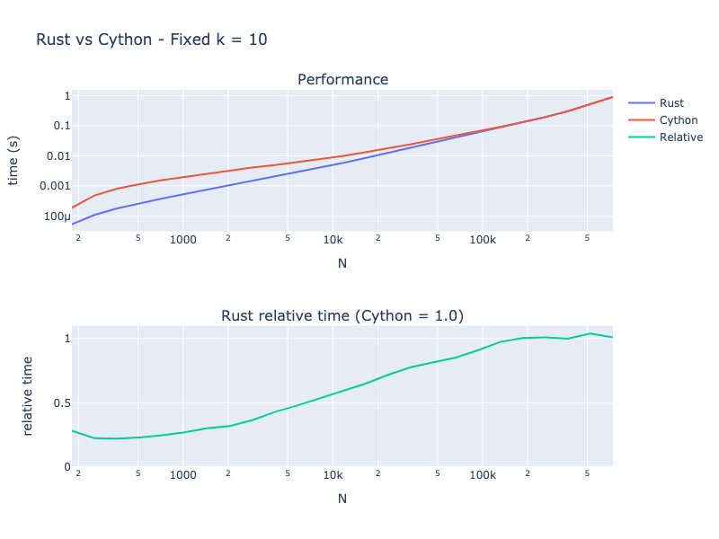
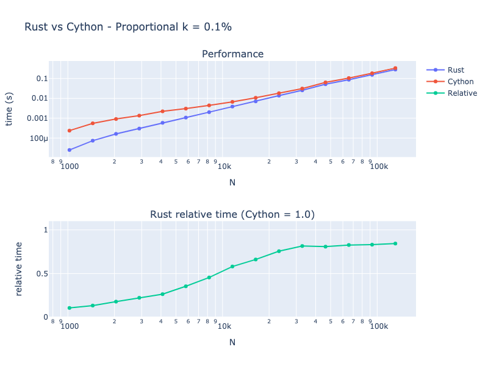
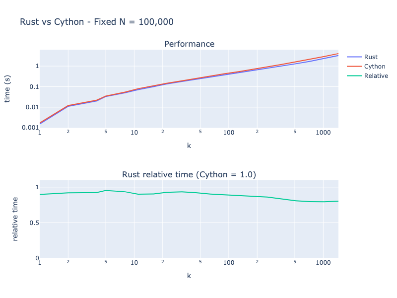

# Rust vs Cython

This repo contains an experiment to compare the performance of [Rust](https://www.rust-lang.org/) against [Cython](https://cython.org/).

The algorithm being tested is a memory optimised version of [Tarjan's strongly connected components algorithm](https://en.wikipedia.org/wiki/Tarjan%27s_strongly_connected_components_algorithm). This algorithm, by [Pearce](https://doi.org/10.1016%2Fj.ipl.2015.08.010), minimises the amount of auxilliary memory required to run the algorithm, which makes this algorithm particularly suited to large graphs. More details on the algorithm can be [found here](http://www.timl.id.au/SCC/).

The Cython implementation is taken from SciPy, via the function [`scipy.sparse.csgraph.connected_components`](https://github.com/scipy/scipy/blob/master/scipy/sparse/csgraph/_traversal.pyx#L649).

The Rust implementation is a direct port of the code from SciPy, taking care to make sure the input and output types of the functions match.

This algorithm is particularly interesting from a performance point of view, because it requires arbitrary access to locations within large arrays. As such, it is not particularly cache friendly, and cannot easily be vectorised or parallelised.


## Repo structure

This repo contains a Rust package called `rust-scc`, which builds a dynamic extension library called `rust_scc`.
This library exports a function called `scc` which can be called from Python.

The file [`benchmark.py`](benchmark.py) contains a script which can be executed to generate a sparse matrix and then profile both the Cython and Rust implementations of the algorithm.

The notebook [`rust_vs_cython.ipynb`](rust_vs_cython.ipynb) provides an environment for running benchmark experiments and visualising their results.

> Note: The notebook can only be run locally, as it requires you to build the Rust package for your local system.

## Building

To build the Rust library, run

```
cargo build --release; rm rust_scc.so; cp target/release/librust_scc.dylib rust_scc.so
```

It's important to run this with the `--release` flag to ensure that optimisations are enabled.

## Running experiments

To run the experiments, run the experiment notebook with the following command.

```
jupyter-lab rust_vs_cython.ipynb
```

You can adjust the parameters used in the experiments to explore different regions of the parameters space.

Each individual measurement takes two parameters, `(N, k)`, generates a random graph with these parameters, and runs each of the `rust` and `python` implementations of the algorithms. The parameter `N` specifies the number of nodes in the graph, and `k` specifies the maximum number of edges from each node. Each run is profiled using the [`line_profiler`](https://github.com/pyutils/line_profiler) package.

The graphs of the results are dynamically updated as the experiments run, so you can break out early if need be.

## Findings

tl;dr: Rust is faster. Mostly. Probably

### Fixed k

When running with a fixed value of `k = 10`, we have a sparse graph with relatively few edges. For small graphs, with `N < 1000`, we see that Rust outperforms Cython by roughly a factor of three.

As `N` gets large, the relative performance difference decreases, until around `N = 200,000`, at which point the algorithms reach parity.



### Proportional k

If we increase `k` as we increase `N`, keeping the proportion of `N/k` at 0.001 (e.g. each node connects to 0.1% of the other nodes), we see similar performance to the fixed `k` case. For small `N`, Rust outperforms Cython by up to a factor of five, but as `N` gets large, the difference flattens out at a relative performance of `0.8`. This suggests that Rust is better at handling larger `k` values than Cython.



### Fixed N

If we keep `N` fixed at `100,000`, and vary the value of `k`, we see that the relative performance is relatively steady, at around `0.9`. As `k` gets larger, we see the relative performance improve to around `0.8`, which is consistent with the Proportional `k` experiment.



## Conclusion

Rust and Cython both provide a way to run compiled code from within Python.
The languages are sufficiently similar that it's possible to do a direct port of Cython code to Rust and get a fair comparison.

For the problem of finding strongly connected components within a sparse graph using Pearce's version of Tarjan's algorithm, the Rust implementation outperforms the Cython implementation in almost all situations.

For small `N` and `k`, this can be up to a five times performance difference. For larger `N` and small `k` the performance approaches parity, while for large `N` and large `k`, Rust has a relative performance of `0.8`.

## Disclaimer

These experiments were run on a MacBook Air (M1, 2020) with 16GB of RAM. The computer was probably doing other things while running the numbers. Neither the code, not the experimental results have been peer reviewed. These results are specific to the particular algorithm under test, and should not be directly applied to other use cases. The presented results are not necessarily statistically significant, nor meaningful. Use at your own risk.
